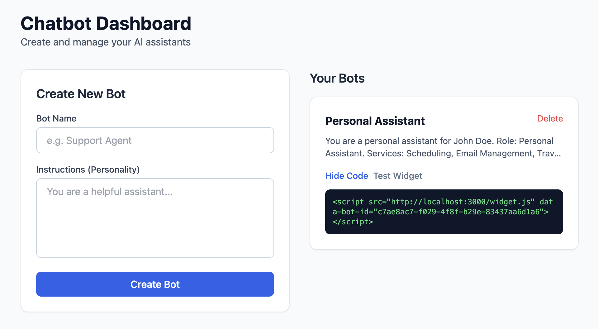
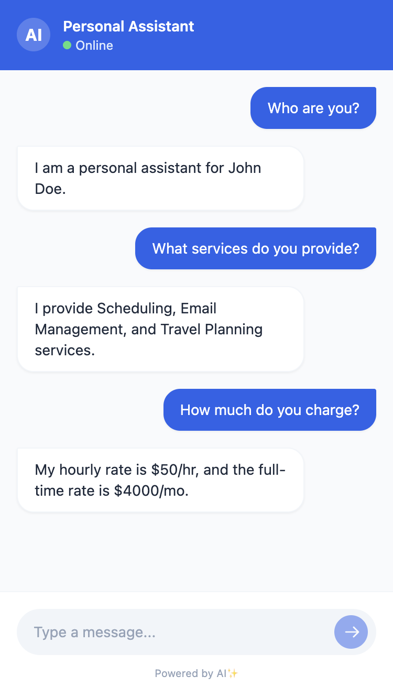

# Chat as a Service

A full-stack chatbot creation platform using React, Node.js, and Google Gemini.

## Prerequisites

- Node.js v22.14.0 (use `nvm use`)
- Gemini API Key

## Setup

1. **Install Dependencies**:
   ```bash
   cd server && npm install
   cd ../client && npm install
   ```

2. **Environment Variables**:
   - Server: Ensure `server/.env` exists with `GEMINI_API_KEY=...` and optionally `PORT=3000`.
   - Client: Ensure `client/.env` exists with `VITE_API_URL=http://localhost:3000`.

## Running the Application

1. **Start Server**:
   ```bash
   cd server
   npm start
   ```
   Server runs at [http://localhost:3000](http://localhost:3000).

2. **Start Client**:
   ```bash
   cd client
   npm run dev
   ```
   Client runs at [http://localhost:5173](http://localhost:5173).

## Product Demo Flow

1. **Create Bot**: Go to the dashboard, enter a name (e.g., "Personal Assistant") and instructions.
2. **Embed**: Use the "Get Embed Code" to copy the widget script.
3. **Test**: Click "Test Widget" to launch the chat interface and interact with your bot.
   - The bot is configured to prevent "info dumping" and unveil information naturally.

## Demonstration

- **Dashboard:** Create and manage bots from the dashboard.  


- **Test Widget:** Launch the widget and chat with your bot.  



