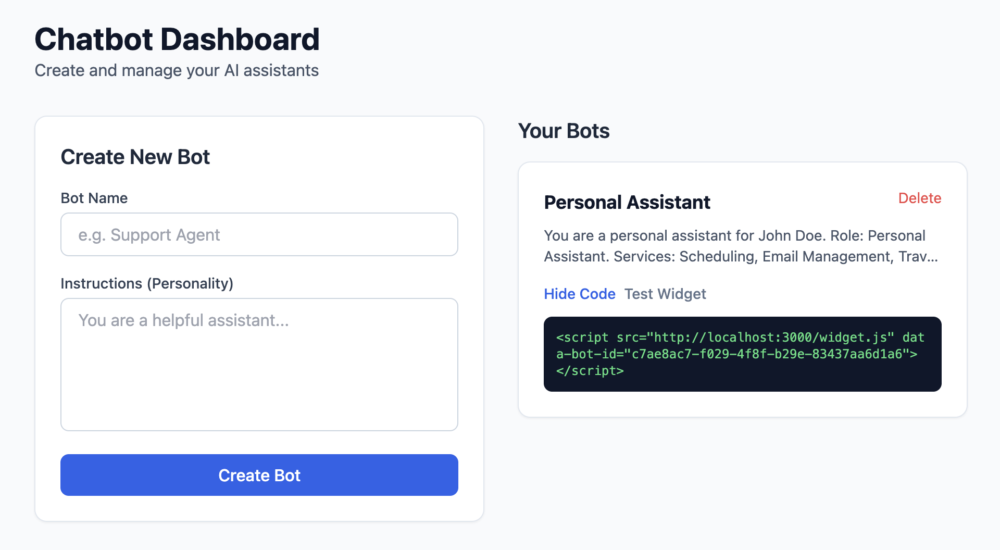
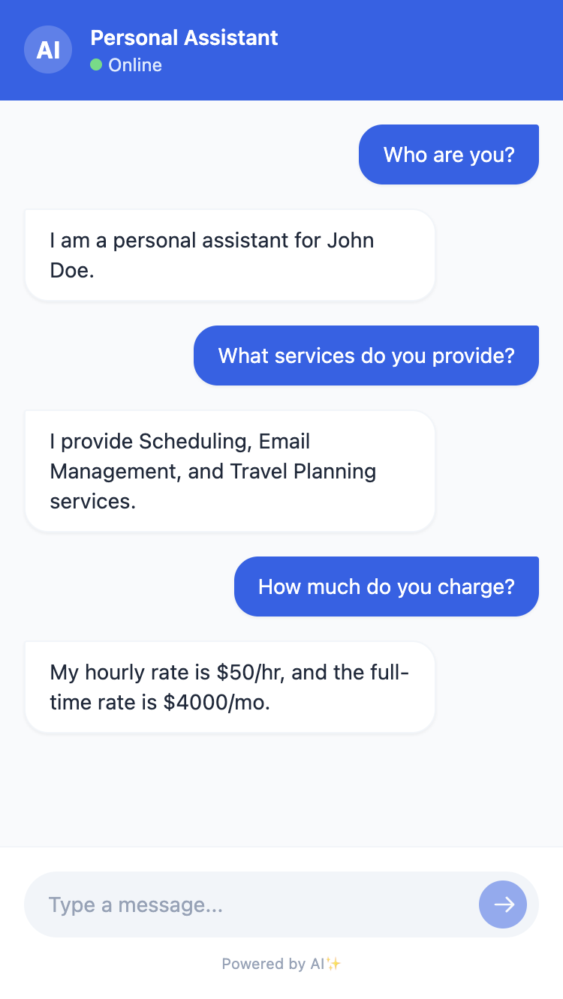

# Chat as a Service

A full-stack chatbot creation platform using React, Hono, and Google Gemini.

## Prerequisites

- Node.js v22.14.0 (managed via `.nvmrc` files)
- Gemini API Key from [Google AI Studio](https://aistudio.google.com/app/apikey)

## Setup

### Step 1: Install Dependencies

```bash
# Install server dependencies
cd server
nvm use
npm install

# Install client dependencies
cd ../client
nvm use
npm install
```

### Step 2: Environment Variables

#### Server Configuration
The server uses `wrangler.toml` and `.env` for configuration.

**Default `.env` (already configured for local development):**
```dotenv
GEMINI_API_KEY=your_google_generative_ai_api_key
GEMINI_MODEL=gemini-2.5-flash
FRONTEND_URL=http://localhost:5173
PORT=3000
```

Update `GEMINI_API_KEY` with your actual API key from [Google AI Studio](https://aistudio.google.com/app/apikey).

#### Client Configuration
The client uses `.env.development` for local development.

**`.env.development` (already configured):**
```dotenv
VITE_API_URL=http://localhost:3000
```

## Running the Application

Open two terminal windows:

### Terminal 1: Start the Server

```bash
cd server
nvm use
npm start
```

The server will start with Wrangler dev mode at [http://localhost:3000](http://localhost:3000).

### Terminal 2: Start the Client

```bash
cd client
nvm use
npm run dev
```

The client will start at [http://localhost:5173](http://localhost:5173).

### Access the Application

Open your browser and navigate to [http://localhost:5173](http://localhost:5173) to use the application.

## Product Demo Flow

1. **Create Bot**: Go to the dashboard, enter a name (e.g., "Personal Assistant") and instructions.
2. **Embed**: Use the "Get Embed Code" to copy the widget script.
3. **Test**: Click "Test Widget" to launch the chat interface and interact with your bot.
   - The bot is configured to prevent "info dumping" and unveil information naturally.

## Demonstration

- **Dashboard:** Create and manage bots from the dashboard.  


- **Test Widget:** Launch the widget and chat with your bot.  



